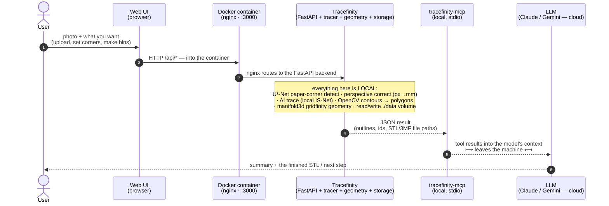

# tracefinity-local-with-mcp

Self-host [Tracefinity](https://github.com/tracefinity/tracefinity) from its
published container image — one local install serving a browser **web UI** and a
**REST API** on `localhost:3000` — plus a local **MCP server** that wraps that
API for any [Model Context Protocol](https://modelcontextprotocol.io) client
(58 tools in the default `open` mode; 74 with a `native` instance). The MCP is a
plain stdio process, not tied to any model or vendor; Claude Code is used in the
examples only because it has a one-command install helper. This has no connection
to the hosted `tracefinity.net`.

This repo is a **deployment overlay**: it contains no upstream source. The
Tracefinity image `ghcr.io/tracefinity/tracefinity:<tag>` in
[`compose.yaml`](compose.yaml) is the only upstream dependency; Dependabot also
bumps the MCP's Python deps and the CI actions.

> **Setting this up with an agent?** Jump to
> [Automated install (for an agent)](#automated-install-for-an-agent) — an ordered,
> non-interactive runbook with explicit success criteria.

## What "Tracefinity" refers to here

Several distinct things get called "Tracefinity" — keep them apart:

| Term | What it is |
|---|---|
| **The local install** | the container this repo runs: image `ghcr.io/tracefinity/tracefinity:<tag>`, its `data/` volume, and your `compose.yaml` / `.env`. Listens on `localhost:3000`. This is the thing you operate, start/stop, and back up. |
| **The web UI** | the browser front-end that install serves at `http://localhost:3000/` — upload a photo, edit tools/bins, download STLs. This is what you'd open on a phone. |
| **The REST API** | the *same* install at `http://localhost:3000/api/*` — this is what the **MCP** drives. The MCP is a pure API client and **never uses the web UI**. |
| **tracefinity.net** | the upstream project's public hosted service. **Unrelated to this repo** — no connection, no shared data, no linked account. |

The web UI and the REST API are one install on one port sharing one workspace
(`data/`), so a photo uploaded from your phone's browser is immediately visible to
the MCP tools, and a bin the MCP creates shows up in the web UI.

## How it works — signal flow



The web UI and the MCP are **two independent clients** of the same local API and
`./data` workspace — neither depends on the other. A common flow: do the visual
steps (photo, corners) in the browser, then have the assistant take over via the
MCP. The diagram shows that as one chain for clarity; mechanically the browser
round-trip and the MCP round-trip are separate.

Steps 1–4 are entirely on your machine (the tracer is local unless you set an AI
key). Only the **MCP → LLM** hop leaves it: the tool arguments and JSON results —
session / tool / bin metadata, polygon coordinates, file paths, **not** the photo
or STL bytes — go to the cloud LLM as part of the conversation. (Drive the whole
workflow in the browser and never involve the LLM, and nothing leaves the box —
see [Security](#security).)

## Layout

```
compose.yaml                     pinned upstream image + local settings
compose.override.example.yaml    host-specific tweaks (copy to compose.override.yaml)
.env.example                     port / bind address / auth mode (copy to .env)
.mcp.json.example                Claude Code registration template
mcp/                             the MCP server — plain MCP stdio, no vendor lock-in
  tracefinity_mcp/               auth.py (OS-user identity), client.py, server.py
  verify.py                      endpoint smoke test against a running instance
scripts/
  preflight.sh                   one-time: check/install the toolchain (brew, git, docker, uv)
  init.sh                        one-time setup (.env, dirs, image pull, uv sync)
  install-mcp.sh                 register the MCP — prompts for Claude / Gemini / both
  doctor.sh                      anytime: is the stack healthy now (daemon, image resolvable, :3000 up)
  scrub-check.sh                 fails if machine/personal strings sneak into tracked files
docs/
  operations.md                  start/stop, upload cap, teardown, troubleshooting
  mcp-tools.md                   the tool catalogue + the typical flow
```

Git-ignored (never committed): `.env`, `compose.override.yaml`, `.mcp.json`,
`data/`, `mcp/.venv/`, `mcp/secrets/`, `mcp/downloads/`.

## Prerequisites

**Easiest:** clone the repo (needs `git`), then run **`./scripts/preflight.sh`**.
It checks everything below, and if you're at a terminal and something is missing it
**asks whether to install it for you** (macOS via Homebrew, Linux via your package
manager). Non-interactive equivalents: `./scripts/preflight.sh --fix` (asks per
item) or `--fix -y` (no prompts). `./scripts/preflight.sh --check` only reports.

**Or install manually** — download pages and per-OS commands:

| Tool | Required? | macOS | Linux | Page |
|---|---|---|---|---|
| **Homebrew** | macOS helper for the rest | `/bin/bash -c "$(curl -fsSL https://raw.githubusercontent.com/Homebrew/install/HEAD/install.sh)"` | *(optional — Linuxbrew)* | <https://brew.sh> |
| **git** | yes — to clone | `xcode-select --install` or `brew install git` | `sudo apt-get install -y git` · `sudo dnf install -y git` · `sudo pacman -S git` | <https://git-scm.com/downloads> |
| **curl** | yes — scripts + installers | preinstalled | preinstalled on most; `sudo apt-get install -y curl` if absent | — |
| **Docker** + Compose v2 plugin, **daemon running** | yes — runs Tracefinity | `brew install --cask docker` then launch Docker.app once | `curl -fsSL https://get.docker.com \| sh` then `sudo usermod -aG docker $USER` and re-login | <https://www.docker.com/products/docker-desktop/> (mac) · <https://docs.docker.com/engine/install/> (Linux) |
| **uv** (bundles Python ≥ 3.10) | yes — MCP server + `verify.py` | `brew install uv` | `curl -LsSf https://astral.sh/uv/install.sh \| sh` | <https://docs.astral.sh/uv/getting-started/installation/> |
| `jq` *or* `python3` | no — `install-mcp.sh gemini` fallback | `brew install jq` | `sudo apt-get install -y jq` (etc.) | <https://jqlang.github.io/jq/download/> |
| `claude` *or* `gemini` CLI | no — only to wire the MCP into that assistant | — | — | [Use with an MCP client](#use-with-an-mcp-client) |
| `gh` (GitHub CLI) | no — only if this repo is **private** (clone auth) | `brew install gh` | `sudo apt-get install -y gh` (etc.) then `gh auth login` | <https://cli.github.com> |

Verify Docker after install: `docker compose version` and `docker info` must both
succeed.

Also: **~6 GB disk** (image ≈ 4.5 GB, model weights, a small host venv) and
outbound internet on first run — the image pull, plus tracing-model weights that
download into the container (some at startup, the rest on first trace; one-time,
cached in `data/`).

If `docker` / `uv` "aren't found" they may just be off your shell `PATH` (common on
macOS: `export PATH="$HOME/.docker/bin:$HOME/.local/bin:$PATH"` — `preflight.sh`
flags this and prints the line for your profile).

## Quick start

```bash
git clone https://github.com/Michael3DPrint/tracefinity-local-with-mcp
cd tracefinity-local-with-mcp

./scripts/preflight.sh           # checks brew/docker/uv/… — offers to install what's missing
./scripts/init.sh                # creates .env + dirs, pulls the image, uv sync
docker compose up -d             # backend answers after ~30-90 s (usually ~40; 502 until then)
(cd mcp && uv run python verify.py)   # expect: ALL CHECKS PASSED

./scripts/install-mcp.sh         # prompts: Claude / Gemini / both  (or pass one as an arg)
```

Open `http://localhost:3000` — that's the local install's **web UI** (the MCP uses
the same install's API at `/api/*`). In the default `open` auth mode there's no
login. On Linux the container may create `./data` root-owned — see
[`docs/operations.md`](docs/operations.md#run-the-container-as-your-host-user).

## Automated install (for an agent)

Given only *"install this repo and make it work"*, follow this exactly. Every step
is idempotent — safe to re-run.

**Adopt these defaults without asking:** clone into the current working directory;
auth mode `open` (no login); bundled IS-Net tracer (no API key); an empty `.env`
is fine. This is a checkout to **run**, not to develop — do not `git add` /
`commit` / `push`, and do not modify tracked files.

**0 — Be able to clone.** Ensure `git` exists (`git --version`). If it's missing:
macOS `xcode-select --install`, Linux `sudo apt-get install -y git`. If the repo
is **private**, also `gh auth login` (install `gh` first) or configure a PAT / SSH key.

**1 — Clone.**
```bash
git clone https://github.com/Michael3DPrint/tracefinity-local-with-mcp
cd tracefinity-local-with-mcp
```

**2 — Toolchain.** `bash scripts/preflight.sh --fix -y` — checks and installs
brew / docker / uv / jq / etc. **It must exit 0 before continuing.** A non-zero
exit means something couldn't be auto-installed — almost always **Docker Desktop
on macOS**, which needs a manual first launch (`open -a Docker`, wait ~30 s), or a
Linux `docker` group re-login. Resolve what it names, then re-run it. If Docker
genuinely can't be installed/started non-interactively, stop and report that.
Then `export PATH="$HOME/.docker/bin:$HOME/.local/bin:$PATH"` for the rest of the run.

**3 — Setup.** `bash scripts/init.sh` — writes `.env`, makes dirs,
`docker compose pull` (~4.5 GB, allow several minutes), `uv sync`. Re-run on a
transient network error.

**4 — Start & wait.** `docker compose up -d`, then poll — the backend loads ML
models and nginx returns **502 for ~30–90 s (usually ~40)**, which is normal:
```bash
for i in $(seq 1 30); do curl -fsS localhost:3000/api/version && break || sleep 6; done
```
Proceed once that prints `{"version":"..."}`.

**5 — Verify (acceptance test).** `cd mcp && uv run python verify.py`.
**Pass = last line is `ALL CHECKS PASSED`.** (In `open` mode the account / login /
2FA / admin-user checks are skipped by design — those tools aren't registered;
that is not a failure.) On failure see
[`docs/operations.md`](docs/operations.md#troubleshooting).

**6 — Register the MCP.** The bare command prompts and would hang an unattended
run — **always pass the client as an argument**:
- Claude Code present → `bash scripts/install-mcp.sh claude`, then confirm the
  client lists `tracefinity` as connected (`claude mcp list` for Claude Code;
  the client's MCP panel otherwise).
- Gemini CLI present → `bash scripts/install-mcp.sh gemini`.
- Neither → skip; the server still runs standalone (`cd mcp && uv run tracefinity-mcp`).

**Done when** all three hold: `curl -fsS localhost:3000/api/version` returns a
version, `verify.py` prints `ALL CHECKS PASSED`, and (if a client CLI exists) the
MCP shows connected. Report those results.

**Reset if interrupted:** `docker compose down && rm -rf data && docker compose up -d`
(data is throwaway). Full teardown in [`docs/operations.md`](docs/operations.md).

## Use with an MCP client

The server speaks MCP over **stdio**. Any client works; point it at:

- **command:** `uv`
- **args:** `run --directory /ABS/PATH/TO/tracefinity-local-with-mcp/mcp tracefinity-mcp`
- **env:** `TRACEFINITY_BASE_URL=http://localhost:3000`
  (`TRACEFINITY_AUTH_MODE=open` is optional — it just skips a mode-detection read;
  the default behaves the same)

| Client | How |
|---|---|
| Claude Code | `./scripts/install-mcp.sh claude` (or copy `.mcp.json.example` → `.mcp.json`) |
| Gemini CLI | `./scripts/install-mcp.sh gemini` (uses `gemini mcp add`, else writes `~/.gemini/settings.json`) |
| Claude Desktop | add the command/args/env above to `claude_desktop_config.json` → `mcpServers` |
| Cursor / Cline / Zed / Continue / Goose / LibreChat / LM Studio | add the same command/args/env in that client's MCP settings |
| SDK / custom (OpenAI Agents SDK, Google ADK, `mcp` Python/TS SDK) | launch it as a stdio server subprocess |
| Try it standalone | `cd mcp && uv run tracefinity-mcp` (or `npx @modelcontextprotocol/inspector uv run --directory mcp tracefinity-mcp`) |

`./scripts/install-mcp.sh` with no argument prompts for **Claude / Gemini / both**.

## Using it from your phone / another device

This is about reaching the local install's **web UI** in a phone browser (uploading
photos is easier there). By default the port is bound to `127.0.0.1` (local only).
To reach it from another device on your network, set `TRACEFINITY_BIND=0.0.0.0` in
`.env` and `docker compose up -d` again — **then read [Security](#security)
first**: with `AUTH_MODE=open` this exposes the local install (web UI *and* API),
unauthenticated, to everyone on that network.

Once bound to `0.0.0.0`, from the same network:

- `http://<this-machine-ip>:<port>` — find the IP with `ipconfig getifaddr en0`
  (macOS) or `hostname -I` (Linux)
- `http://<this-machine-hostname>.local:<port>` — usually works from phones and
  survives IP changes

If the macOS firewall is on, allow incoming connections for Docker when prompted.

## Security

This is a **local, single-user** deployment. See
[Authentication: three separate layers](#authentication-three-separate-layers)
for the distinction between your LLM-client login, the MCP↔install path, and the
local install's own auth; the notes below are about the deployment as a whole. The
hardening here (CI, digest-pin option, resource caps) is defense-in-depth for
sharing the repo — the deployment itself is intentionally minimal.

### Network exposure

**Every call in the system:**

| # | Call | Transport | Travels over | Authenticated? |
|---|---|---|---|---|
| 1 | you ⇄ your assistant (Claude Code / Gemini) | the vendor's own API | internet | your vendor account — **layer 1**, outside this repo |
| 1b | MCP tool results → the assistant's LLM | rides row 1 (part of the conversation) | internet | — when you use the MCP, tool arguments + JSON results (session / tool / bin metadata, coordinates, file paths — **not** the photo or STL bytes) reach the LLM provider, like any other message |
| 2 | assistant → `tracefinity-mcp` | local **stdio** subprocess — no socket, no port | **same machine only** | none; the trust is "you ran `install-mcp.sh`". Inherits the assistant's OS user + env |
| 3 | `tracefinity-mcp` → local install `/api/*` | HTTP to `TRACEFINITY_BASE_URL` | **loopback** (keep it that way) | **none** — this setup has no Tracefinity auth (**layer 2**) |
| 4 | browser / phone → local install `/` (web UI) | HTTP | **loopback**, or **LAN** if `TRACEFINITY_BIND=0.0.0.0` | **none** — same open instance, no login (**layer 3**) |
| 5 | `docker compose pull` → GHCR | HTTPS, outbound | internet | none (public image); once per pinned version |
| 6 | container → GitHub releases | HTTPS, outbound | internet | none; tracing-model weights (some at container startup, the rest on first trace), one-time, cached in `data/` |
| 7 | container → Gemini / Replicate / fal | HTTPS, outbound | internet | **your API key — only if you set one** in `compose.override.yaml`; off by default |

Rows 2–4 are request/response *into* the local stack; 5–7 are the container
reaching *out*; rows 1 / 1b are between you and your cloud assistant. Nothing here
*accepts* a connection from the internet (see the inbound table).

**Inbound — who can reach the local install** (rows 3–4 above), set by `TRACEFINITY_BIND`:

| Tier | `TRACEFINITY_BIND` | Who can hit `:3000` | With `AUTH_MODE=open` (default) |
|---|---|---|---|
| **Loopback** (default) | `127.0.0.1` | only this machine | fine — nothing off-box can connect |
| **LAN** | `0.0.0.0` | every device on the same network — your phone, other computers, *and* anything else on that Wi-Fi/subnet (a guest laptop, a compromised IoT device) | **unauthenticated full access** for all of them. Only do this on a network you control; there is no auth to fall back on. |
| **Internet / external** | — | **nothing.** This repo binds a local port only — it never sets up port-forwarding, a tunnel, or a public reverse proxy. | n/a |

**This overlay is built for a single user on loopback or a trusted LAN — that's
the whole point.** It has no authentication and does not add any. If you need
multi-user access, real logins, or any internet exposure, this is the wrong tool:
deploy Tracefinity yourself behind your own auth proxy + TLS (or use upstream's
Helm chart). Do not port-forward / tunnel (`ngrok`, `cloudflared`, a reverse
proxy) this setup as-is — an open instance on a public address is immediate,
total data loss.

**Bottom line:** the *install* is local — only inbound path is loopback, only
outbound is the one-time image pull + model weights. But **driving it through the
MCP puts your workspace metadata into a cloud LLM conversation** (row 1b); the
browser path (row 4) does not. Setting `TRACEFINITY_BIND=0.0.0.0` adds LAN
inbound; nothing here ever adds internet inbound; setting an AI key adds row 7.

### Other notes

- **No access control, by design.** There is no login; anyone who can reach the
  port has full API access — upload, trace, generate, **read and delete all
  data**. That is acceptable *only* because the intended deployment is loopback or
  a LAN you control (see the tables above).
- **No TLS.** All traffic is plain HTTP. Fine over loopback; over a LAN, uploaded
  photos and traced data cross the network in the clear.
- **Keep `TRACEFINITY_BASE_URL` local.** The MCP follows redirects and, if it ever
  reached a real login, would send credentials; point it only at
  `http://localhost` / `https://…`, never a remote plain-HTTP host.
- **Secrets live only in git-ignored files:** `.env`, `compose.override.yaml`,
  `mcp/secrets/` (0600). Put real `GOOGLE_API_KEY` / `REPLICATE_API_TOKEN` /
  `FAL_KEY` in `compose.override.yaml`, never in `compose.yaml`. `scrub-check.sh`
  (also in CI) fails the build on leaked machine paths.
- **The MCP exposes destructive tools** (`delete_my_data`, `delete_*`) and feeds
  workspace content — tool names, notes, AI-generated labels — straight into the
  model. Treat that content as untrusted (prompt-injection surface), especially
  before wiring this into an autonomous agent, and doubly so in `open` + LAN mode
  where anyone can plant content. (The account/login/2FA/admin tools aren't
  registered in `open` mode — see
  [Authentication](#authentication-three-separate-layers).)
- **`upload_photo` / `download_*` read and write arbitrary local paths** with the
  MCP process's privileges (`download_*` takes a `dest_dir`; `upload_photo` takes
  any file path). Same caution as any file tool.
- **`preflight.sh --fix`** runs the official installer scripts for Homebrew / uv /
  Docker (`curl … | sh`) and, on Linux, `sudo` package installs — only when you
  confirm or pass `-y`. Adding your user to the `docker` group (Linux) grants
  root-equivalent host access; that's Docker's model, not this repo's.
- **CI runs PR-supplied code** in an ephemeral runner with a read-only token and
  no secrets. Keep the repo private, or rely on GitHub's first-run-contributor
  approval gate, if that matters to you.
- **Image is pinned by tag, not digest.** Add a digest pin in
  `compose.override.yaml` (see the example) for immutability.
- Container runs as non-root (UID 1000) with `no-new-privileges`. Optional
  `mem_limit` / `pids_limit` hardening is in `compose.override.example.yaml`.

## The MCP server

`mcp/` is a standalone Python package (`mcp[cli]<2`, `httpx` — no model/vendor
SDK). It speaks the MCP protocol over stdio, derives its identity from the OS
user at runtime, and stores nothing sensitive in the repo. `server.py` wraps
every REST endpoint as a tool: upload / corners / trace, sessions, the tool
library, bins, bin-projects, photo-stations, and file downloads (STL / 3MF / SVG
land in `mcp/downloads/`).

**Talks only to the local API.** The MCP calls your local Tracefinity at
`TRACEFINITY_BASE_URL` — including reading `/api/auth/status` to detect the mode.
In the default `open` mode it does **no login or account operations** (no
`/api/auth/setup`, no `/api/auth/login`, no credentials), and the **16**
account / login / 2FA / admin-management tools are **not registered** — **58
tools, not 74**. Setting `TRACEFINITY_AUTH_MODE=native` against a local `native`
instance registers the other 16, but that isn't the documented default. See
[Authentication](#authentication-three-separate-layers); tool catalogue:
[`docs/mcp-tools.md`](docs/mcp-tools.md).

## Authentication: three separate layers

"Auth" here means three unrelated things. Only layer 1 exists in this setup:

```
 (1) LLM / client auth      (2) MCP → local install      (3) local install's own auth
 ─────────────────────      ──────────────────────       ────────────────────────────
 Claude Code / Gemini  ──▶  tracefinity-mcp (stdio)  ──▶  the LOCAL INSTALL, :3000
 signed in as you           no listener, no network        ├─ REST API  /api/*  ◀── MCP
 (claude.ai / Google);      no credentials, no login       └─ web UI    /       ◀── browser / phone
 it launches the MCP        (local API calls only)         AUTH_MODE = open  (no login)
```

(The "local install" is your self-hosted container — **not** `tracefinity.net`. Its
REST API and web UI are the same install on the same port.)

**(1) LLM / client auth** — how *you* are signed in to the assistant and its API
billing (claude.ai, a Google account, …). Entirely the client's concern; **this
repo touches none of it**. The client starts `tracefinity-mcp` as a local child
process — registering it (`install-mcp.sh` or `.mcp.json`) is an explicit local
trust grant. There is no port, token, or password between the client and the MCP:
the MCP trusts whatever process spawned it and inherits that process's OS user
and environment.

**(2) MCP → local install** — **no credentials.** The MCP reads
`/api/auth/status` (a local call) to detect the mode, then in `open` mode does no
`setup`/`login` and sends nothing; `mcp/secrets/` stays empty. It *can* provision
and log in against a local `native` instance, but that isn't the documented
default.

**(3) The local install's own auth** — **none.** `AUTH_MODE=open`: no accounts, no
login, no 2FA, single `default` workspace. Anyone who can reach the port has full
access to the API and web UI alike — which is why the port is loopback by default
and LAN use is "trusted networks only" (see [Security](#security)).

This is deliberate: the project's purpose is a **single-user, local or
trusted-LAN** deployment. It's documented for `open` mode; the MCP also works
against a local `native` instance but that's not the focus. If you need multiple
users or internet exposure, run Tracefinity yourself behind your own auth proxy.

| Layer | Authenticates | In this setup |
|---|---|---|
| (1) LLM client | you → the assistant + its API | your vendor account — not touched by this repo |
| (2) MCP → local install | the MCP process → the REST API | **none** |
| (3) Local install | callers of the API + web UI | **none** (`open` mode) |

## Keeping upstream in sync

[`.github/dependabot.yml`](.github/dependabot.yml) tracks three things:

| ecosystem | path | schedule | what |
|---|---|---|---|
| `docker-compose` | `/` | weekly | the Tracefinity image tag in `compose.yaml` |
| `uv` | `/mcp` | weekly | the MCP's Python deps (`mcp`, `httpx`) via `mcp/uv.lock` |
| `github-actions` | `/` | monthly | the CI action versions |

For an image bump, CI (`.github/workflows/ci.yml`) starts the new image and runs
`verify.py` against it (endpoint smoke test only — it does **not** exercise
tracing or geometry, so still eyeball a real photo after a major jump). **Merging
the PR is how you adopt an update**, then locally:

```bash
docker compose pull && docker compose up -d
```

Manual bump: edit the tag in `compose.yaml` (or set an override in
`compose.override.yaml`) and pull.

## Notes

- Claude Code's project memory is stored under `~/.claude/`, separate from this
  repo — nothing about your setup is captured here.
- Not affiliated with or endorsed by Tracefinity. Upstream is MIT licensed.
