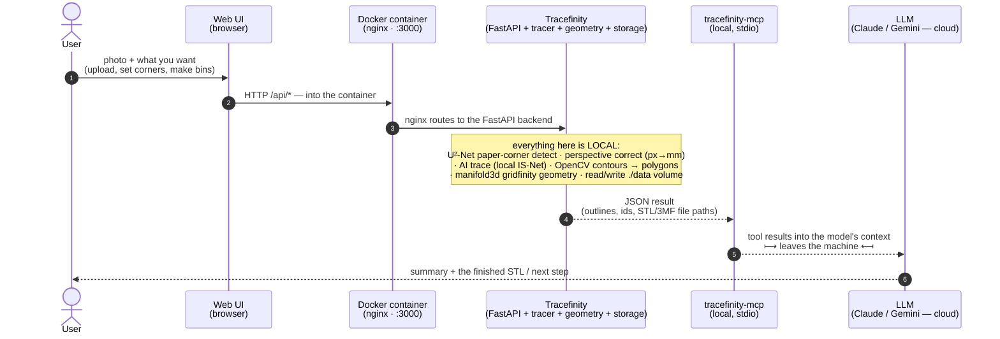

# How it works

## What "Tracefinity" refers to here

Several distinct things get called "Tracefinity" — keep them apart:

| Term | What it is |
|---|---|
| **The local install** | the container this repo runs: image `ghcr.io/tracefinity/tracefinity:<tag>`, its `data/` volume, and your `compose.yaml` / `.env`. Listens on `localhost:3000`. This is the thing you operate, start/stop, and back up. |
| **The web UI** | the browser front-end that install serves at `http://localhost:3000/` — upload a photo, edit tools/bins, download STLs. This is what you'd open on a phone. |
| **The REST API** | the *same* install at `http://localhost:3000/api/*` — this is what the **MCP** drives. The MCP is a pure API client and **never uses the web UI**. |
| **tracefinity.net** | the upstream project's public hosted service. **Unrelated to this repo** — no connection, no shared data, no linked account. |

The web UI and the REST API are one install on one port sharing one workspace
(`data/`), so a photo uploaded from your phone's browser is immediately visible to
the MCP tools, and a bin the MCP creates shows up in the web UI.

## Signal flow



The web UI and the MCP are **two independent clients** of the same local API and
`./data` workspace — neither depends on the other. A common flow: do the visual
steps (photo, corners) in the browser, then have the assistant take over via the
MCP. The diagram shows that as one chain for clarity; mechanically the browser
round-trip and the MCP round-trip are separate.

Steps 1–4 are entirely on your machine (the tracer is local unless you set an AI
key). Only the **MCP → LLM** hop leaves it: the tool arguments and JSON results —
session / tool / bin metadata, polygon coordinates, file paths, **not** the photo
or STL bytes — go to the cloud LLM as part of the conversation. (Drive the whole
workflow in the browser and never involve the LLM, and nothing leaves the box —
see [security.md](security.md).)

## Repo layout

```
compose.yaml                     pinned upstream image + local settings
compose.override.example.yaml    host-specific tweaks (copy to compose.override.yaml)
.env.example                     port / bind address / auth mode (copy to .env)
.mcp.json.example                Claude Code / Desktop registration template
mcp/
  tracefinity_mcp/               auth.py (OS-user identity), client.py, server.py
  verify.py                      endpoint smoke test against a running instance
scripts/
  preflight.sh                   one-time: check/install the toolchain (brew, git, docker, uv)
  init.sh                        one-time setup (.env, dirs, image pull, uv sync)
  install-mcp.sh                 register the MCP — prompts for Claude / Gemini / both
  doctor.sh                      anytime: is the stack healthy now (daemon, image resolvable, :3000 up)
  scrub-check.sh                 fails if machine/personal strings sneak into tracked files
docs/
  how-it-works.md   agent-install.md   security.md   operations.md   mcp-tools.md
```

Git-ignored (never committed): `.env`, `compose.override.yaml`, `.mcp.json`,
`data/`, `mcp/.venv/`, `mcp/secrets/`, `mcp/downloads/`.
